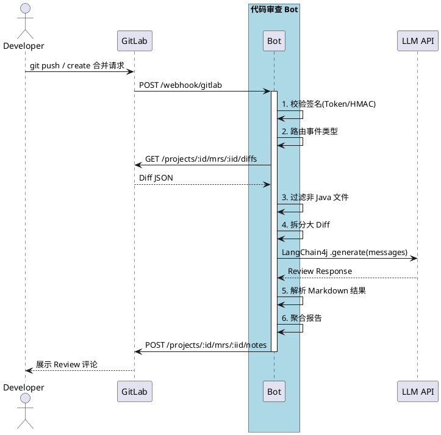

# 代码审查 Bot 技术方案

> 面向 Java 项目的自动化代码审查工具，集成大模型对 Git 提交变更进行智能评审。

---

## 目录

1. [项目概述](#1-项目概述)
2. [系统架构](#2-系统架构)
3. [核心模块设计](#3-核心模块设计)
4. [触发机制](#4-触发机制)
5. [AI 分析引擎](#5-ai-分析引擎)
6. [GitLab 集成](#6-gitlab-集成)
7. [数据模型](#7-数据模型)
8. [API 接口规范](#8-api-接口规范)
9. [错误处理与韧性设计](#9-错误处理与韧性设计)
10. [部署方案](#10-部署方案)
11. [配置管理](#11-配置管理)
12. [监控与可观测性](#12-监控与可观测性)
13. [测试策略](#13-测试策略)
14. [扩展与优化](#14-扩展与优化)

---

## 1. 项目概述

### 1.1 背景与目标

在多人协作的 Java 项目中，代码质量管控依赖人工审核代码，存在效率低、覆盖不全、标准不统一等问题。本项目旨在通过大模型自动化分析每次 Git 提交的代码变更，在 代码推送 / 合并请求 节点即时输出结构化审查报告，降低 代码审查 成本，提升代码质量基线。

### 1.2 核心能力

| 能力 | 说明                             |
| -------------- |--------------------------------|
| 自动触发 | Webhook + Git Hook 双触发，无需人工介入  |
| 多维度分析 | 安全漏洞、性能隐患、编码规范三个维度             |
| 逐文件粒度 | 对每个变更文件独立分析，定位到具体行号            |
| 报告回写 | 结构化 审查 报告自动评论至 合并请求            |
| 快速响应 | 单次 审查 平均响应时间 < 30s             |
| 韧性保障 | 失败重试、幂等去重、API 限流感知、优雅降级        |
| 可观测 | Prometheus 指标暴露 + 结构化日志 + 健康检查 |

### 1.3 技术栈

```
Java 17 · Spring Boot 3 · MyBatis-Plus · MySQL · LangChain4j · DeepSeek API · GitLab API · Docker · Prometheus
```

### 1.4 核心流程（时序图）




---

## 1.5 设计思路与价值分析

### 背景

传统 GitLab 合并请求 流程中，代码审查完全依赖人力：

- Reviewers 需要逐文件查看 Diff、定位问题、撰写评论
- 常见低级问题（资源未关闭、N+1 查询、SQL 注入风险、空指针隐患）重复出现
- 大型 合并请求 审查耗时 30 分钟以上，审查者疲劳后容易遗漏
- 团队经验难以沉淀，人员流动导致审查标准不一致

### 核心思路

在 GitLab 合并请求 流程中嵌入 AI 自动化审查环节，让 DeepSeek 大模型替代人工完成第一轮代码扫描。

> **AI 做机械性检查，人聚焦业务逻辑和架构决策。**

Bot 的设计定位是"第一道防线"——不是取代人的 代码审查，而是过滤掉 60-70% 的重复性、机械性问题，让人 Reviewer 把精力集中在高价值的部分。

### 处理流程

```
开发者提交 合并请求 → GitLab Webhook 触发 → 拉取 Diff → AI 三维度分析
    → 聚合报告 → 回写 合并请求 评论 → 持久化记录
```

三个分析维度：

| 维度 | 检查项 |
|------|--------|
| 安全漏洞 | SQL/命令/表达式注入、敏感信息泄露、权限绕过、不安全加密 |
| 性能隐患 | N+1 查询、大事务、全表扫描、内存泄漏、线程安全 |
| 编码规范 | 异常处理不当、空指针风险、资源未释放、日志级别不当 |

### 实际价值

#### 效率提升

| 场景 | 之前 | 之后 |
|------|------|------|
| 安全漏洞检查 | 审查者人工查看，依赖个人经验 | AI 正则 + 语义分析，固定模板覆盖 |
| 性能问题发现 | 靠经验积累才能识别 | Prompt 模板系统化检查 |
| 编码规范审查 | 逐行阅读，耗时巨大 | AI 逐文件并发覆盖 |
| 新人代码质量 | 审查者花大量时间反复教导 | AI 先给出修复建议，人做确认 |

#### 量化收益

- **合并请求 审查耗时降低**：AI 并发分析数秒到十几秒出结果，人只需确认结论
- **遗漏率降低**：AI 不会疲劳，每次覆盖全部文件的三个分析维度
- **知识沉淀**：审查规则固化在 Prompt 模板中，不随人员流动丢失
- **新人友好**：提交代码后 AI 先给反馈，减少 Reviewers 的重复解释成本

### 适用场景

- 中大规模 Java 项目（20 人以上开发团队，MR 频繁）
- 对代码质量和安全性有较高要求的团队
- 希望降低 代码审查 人力成本但不牺牲质量的团队
- 需要统一代码审查标准的团队

### 局限性

- **不擅长业务逻辑理解**——AI 无法判断业务实现是否正确
- **不擅长架构决策**——分层设计、模块划分等需要人判断
- **可能产生误报**——AI 审查结果需要人确认，不能完全自动化合并

---

## 2. 系统架构

### 2.1 整体架构图

```
┌──────────────────────────────────────────────────────────┐
│                   GitLab / Git Client                    │
│   Push Event  ──►  Webhook ──►  合并请求 Event           │
└────────────────────────┬─────────────────────────────────┘
                         │ HTTP POST
                         ▼
┌──────────────────────────────────────────────────────────┐
│              代码审查 Bot (Spring Boot)                  │
│                                                          │
│   ┌──────────────┐     ┌───────────────────────────────┐ │
│   │ Webhook      │     │  Git Hook Receiver            │ │
│   │ Controller   │     │  (post-receive)               │ │
│   └──────┬───────┘     └────────────┬──────────────────┘ │
│          │                          │                    │
│          └──────────┬───────────────┘                    │
│                     ▼                                    │
│          ┌──────────────────┐                            │
│          │ WebhookSignature │  ← HMAC-SHA256 签名验证    │
│          │ Filter           │    + Token 校验            │
│          └────────┬─────────┘                            │
│                   ▼                                      │
│          ┌──────────────────┐                            │
│          │  RateLimit       │  ← 基于 IP 的限流           │
│          │  Interceptor     │    (60 req/min per IP)     │
│          └────────┬─────────┘                            │
│                   ▼                                      │
│          ┌──────────────────┐                            │
│          │  Event Dispatcher│  ← 事件类型路由 + 异步      │
│          └────────┬─────────┘                            │
│                   │                                      │
│          ┌────────▼──────────┐                           │
│          │  Dedup Checker    │  ← Caffeine + DB 双重     │
│          │                   │    去重                   │
│          └────────┬──────────┘                           │
│                   │                                      │
│          ┌────────▼──────────┐                           │
│          │  Diff Fetcher     │  ← GitLab API 拉取 Diff   │
│          └────────┬──────────┘                           │
│                   │                                      │
│          ┌────────▼──────────┐                           │
│          │  File Filter      │  ← Java / 大小 / 模式     │
│          └────────┬──────────┘                           │
│                   │                                      │
│          ┌────────▼──────────┐                           │
│          │  AiReviewService  │  ← LangChain4j 并发审查   │
│          │  + RetryHandler   │    + Semaphore 限并发     │
│          └────────┬──────────┘                           │
│                   │                                      │
│          ┌────────▼──────────┐                           │
│          │  Report Builder   │  ← Markdown 报告聚合       │
│          └────────┬──────────┘                            │
│                   │                                       │
│          ┌────────▼──────────┐                            │
│          │  GitLab Comment   │  ← 合并请求 Note API 回写   │
│          │  Writer           │                            │
│          └────────┬──────────┘                            │
│                   │                                       │
│          ┌────────▼──────────┐                            │
│          │  Review Record    │  ← MyBatis-Plus 持久化     │
│          │  Service          │                            │
│          └───────────────────┘                            │
└──────────────────────────────────────────────────────────┘
                         │
                         ▼
            ┌────────────────────────┐
            │   Merge Request Comment│
            │   (Structured Report)  │
            └────────────────────────┘
```

### 2.2 模块职责

| 模块 | 职责 |
| ----------------------- | ------------------------------------------------- |
| Webhook Controller | 接收 GitLab Push / 合并请求 Webhook 事件 |
| Git Hook Controller | 接收服务端 post-receive Git Hook 回调 |
| WebhookSignatureFilter | 校验 Webhook HMAC-SHA256 签名和 Token，缓存请求体 |
| RateLimitInterceptor | 基于 IP 的 API 限流（60 req/min） |
| Event Dispatcher | 事件路由，区分 Push / 合并请求 / 原始 Hook 类型 |
| Dedup Checker | Caffeine 内存 + 数据库双重去重 |
| Diff Fetcher | 调用 GitLab API 获取 Diff 数据 |
| File Filter | 过滤非 Java 文件、超大 Diff、自动生成代码 |
| AiReviewService | 调用 LangChain4j ChatLanguageModel，逐文件构造 Prompt 并解析结果 |
| RetryHandler | Spring Retry 指数退避重试 |
| Report Builder | 聚合各文件分析结果，构建 Markdown 格式报告 |
| GitLab Comment Writer | 调用 GitLab 合并请求 Note / 提交记录 Comment API 回写报告 |
| Review Record Service | MyBatis-Plus 持久化审查记录，支持分页查询和统计 |

---

## 3. 核心模块设计

### 3.1 项目结构

```
code-review-bot/
├── src/main/java/com/ctgu/reviewbot/
│   ├── CodeReviewBotApplication.java     # Spring Boot 入口
│   ├── config/                           # 配置类
│   ├── controller/                       # 入口层
│   ├── filter/                           # Servlet Filter
│   ├── interceptor/                      # Handler Interceptor
│   ├── service/                          # 业务逻辑层
│   ├── model/                            # 数据模型
│   ├── mapper/                           # MyBatis-Plus Mapper
│   ├── client/                           # 外部 API 客户端
│   ├── util/
│   └── monitoring/                       # 监控指标
├── src/main/resources/
│   ├── application.yml                   # 主配置
│   ├── application-dev.yml               # 开发环境
│   ├── application-prod.yml              # 生产环境
│   ├── schema.sql                        # DDL
│   ├── mapper/
│   └── prompts/
│       ├── review-template.txt           # 用户 Prompt 模板
│       └── system-prompt.txt             # 系统 Prompt
├── src/test/java/com/ctgu/reviewbot/
├── Dockerfile
├── docker-compose.yml
├── eclipse-formatter.xml                 # 代码风格
├── pom.xml
└── .env.example
```

### 3.2 线程池配置

```java
@Configuration
public class ThreadPoolConfig {

    @Bean("reviewExecutor")
    public ExecutorService reviewExecutor(ExecutorProperties props) {
        return new ThreadPoolExecutor(
            props.getCorePoolSize(),                // 核心线程数, 默认 2
            props.getMaxPoolSize(),                 // 最大线程数, 默认 4
            60L, TimeUnit.SECONDS,
            new LinkedBlockingQueue<>(props.getQueueCapacity()),  // 有界队列, 默认 100
            new ThreadFactoryBuilder().setNameFormat("review-%d").build(),
            new ThreadPoolExecutor.CallerRunsPolicy()             // 队列满时由调用线程执行, 产生背压
        );
    }

    @Getter @Setter
    @ConfigurationProperties(prefix = "executor.review")
    public static class ExecutorProperties {
        private int corePoolSize = 2;
        private int maxPoolSize = 4;
        private int queueCapacity = 100;
    }
}
```

---

## 4. 触发机制

### 4.1 GitLab Webhook 触发（推荐）

**配置步骤：**

1. 进入 GitLab 项目 → Settings → Webhooks
2. 填写 URL：`https://<your-bot-host>/api/webhook/gitlab`，本地开发可以使用内网穿透工具如ngrok
3. 设置 Secret Token（与环境变量 `WEBHOOK_SECRET` 一致）
4. 勾选事件：`Push events` + `Merge request events`
5. 保存，GitLab 会在对应事件发生时 POST 请求

**Webhook 事件处理：**

```java
@Slf4j
@RestController
@RequestMapping("/api/webhook")
public class WebhookController {

    private final EventDispatcherService dispatcherService;

    @PostMapping("/gitlab")
    public ResponseEntity<ApiResponse<Void>> handleWebhook(
            @RequestHeader("X-Gitlab-Event") String eventType,
            @RequestHeader(value = "X-Gitlab-Token", required = false) String token,
            @RequestBody WebhookEvent event) {

        log.info("Received GitLab webhook: type={}, project={}", eventType, event.projectId());
        switch (eventType) {
            case "Push Hook" -> {
                dispatcherService.handlePush(event);
            }
            case "Merge Request Hook" -> {
                if (dispatcherService.shouldTriggerReview(event)) {
                    dispatcherService.handleMergeRequest(event);
                } else {
                    log.info("合并请求 event skipped (not open or target branch not matched)");
                }
            }
            default -> log.info("Ignored event type: {}", eventType);
        }
        return ResponseEntity.ok(ApiResponse.success(null));
    }
}
```

### 4.2 Webhook 签名验证过滤器

使用 `OncePerRequestFilter` + HMAC-SHA256 验证签名：

```java
@Component
@Order(1)
public class WebhookSignatureFilter extends OncePerRequestFilter {

    private static final String HMAC_ALGORITHM = "HmacSHA256";

    @Override
    protected boolean shouldNotFilter(HttpServletRequest request) {
        String path = request.getRequestURI();
        return !path.startsWith("/api/webhook/") && !path.startsWith("/api/hook/");
    }

    @Override
    protected void doFilterInternal(HttpServletRequest request,
            HttpServletResponse response, FilterChain chain) throws ServletException, IOException {

        ContentCachingRequestWrapper wrappedRequest = new ContentCachingRequestWrapper(request);
        String secret = webhookProperties.getSecret();
        if (secret == null || secret.isBlank()) {
            chain.doFilter(wrappedRequest, response);
            return;
        }

        String token = request.getHeader("X-Gitlab-Token");
        if (token == null) token = request.getHeader("X-Hook-Secret");
        if (token == null || token.isBlank()) {
            response.sendError(403, "Missing webhook token");
            return;
        }

        byte[] bodyBytes = getBodyBytes(wrappedRequest);
        String expectedSignature = computeHmac(secret, bodyBytes);
        if (!MessageDigest.isEqual(expectedSignature.getBytes(StandardCharsets.UTF_8),
                token.getBytes(StandardCharsets.UTF_8))) {
            response.sendError(403, "Invalid webhook signature");
            return;
        }
        chain.doFilter(wrappedRequest, response);
    }
}
```

限流拦截器（基于 IP，每分钟 60 次）：

```java
@Component
public class RateLimitInterceptor implements HandlerInterceptor {

    private final Cache<String, AtomicInteger> requestCounts = Caffeine.newBuilder()
        .expireAfterWrite(1, TimeUnit.MINUTES).maximumSize(10_000).build();

    private static final int MAX_REQUESTS_PER_MINUTE = 60;

    @Override
    public boolean preHandle(HttpServletRequest request, HttpServletResponse response, Object handler) {
        String clientIp = getClientIp(request);
        AtomicInteger count = requestCounts.get(clientIp, k -> new AtomicInteger(0));
        if (count != null && count.incrementAndGet() > MAX_REQUESTS_PER_MINUTE) {
            response.setStatus(429);
            return false;
        }
        return true;
    }
}
```

### 4.3 幂等去重

Caffeine 缓存 + 数据库双重检测：

```java
@Service
public class DedupService {

    private final ReviewRecordMapper reviewRecordMapper;
    private final Cache<String, Boolean> reviewCache = Caffeine.newBuilder()
            .expireAfterWrite(24, TimeUnit.HOURS).maximumSize(10_000).build();

    public boolean isDuplicate(String projectId, String commitSha) {
        String key = projectId + ":" + commitSha;
        // 内存缓存
        if (reviewCache.asMap().putIfAbsent(key, Boolean.TRUE) != null) {
            return true;
        }
        // 数据库兜底（重启后保护）
        Long count = reviewRecordMapper.selectCount(
            new LambdaQueryWrapper<ReviewRecord>().eq(ReviewRecord::getCommitSha, commitSha));
        return count != null && count > 0;
    }
}
```

### 4.4 Git Hook 触发（服务端）

在 Git 服务端配置 `post-receive` Hook，作为 Webhook 不可用时的兜底方案：

```bash
#!/bin/bash
# /path/to/repo.git/hooks/post-receive

BOT_URL="https://<your-bot-host>/api/hook/post-receive"

while read oldrev newrev refname; do
    curl -s -X POST "$BOT_URL" \
         -H "Content-Type: application/json" \
         -H "X-Hook-Secret: ${WEBHOOK_SECRET}" \
         -d "{\"oldrev\":\"$oldrev\",\"newrev\":\"$newrev\",\"ref\":\"$refname\"}"
done
```

Git 服务端接收端：

```java
@PostMapping("/post-receive")
public ResponseEntity<ApiResponse<Void>> handlePostReceive(@RequestBody Map<String, String> payload) {
    String newRev = payload.get("newrev");
    String ref = payload.get("refname");
    if (newRev == null || "0000000000000000000000000000000000000000".equals(newRev)) {
        return ResponseEntity.ok(ApiResponse.success(null)); // 分支删除
    }
    String projectId = payload.getOrDefault("project_id", "unknown");
    String branch = ref != null ? ref.replace("refs/heads/", "") : "unknown";
    dispatcherService.handlePushRaw(projectId, newRev, branch);
    return ResponseEntity.ok(ApiResponse.success(null));
}
```

### 4.5 触发决策矩阵

| 事件来源 | 触发条件 | 审查内容 | 评论目标 |
| ------------ | -------------------------------- | ------------------ | -------------- |
| 合并请求 Webhook | 合并请求 打开 / 新 Push，目标分支匹配 | 完整 合并请求 Diff | 合并请求 评论区 |
| Push Webhook | Push 至非 合并请求 分支 | 单 提交记录 Diff | 提交记录 评论区 |
| Git Hook | 服务端 post-receive 回调 | 单 提交记录 Diff | 提交记录 评论区 |

---

## 5. AI 分析引擎

### 5.1 Prompt 设计

#### 系统级 Prompt

```
你是一名资深 Java 后端工程师，拥有 10 年以上代码审查经验。
请严格遵循以下审查标准：

- 只指出确定存在的问题，不确定的问题不要列出
- 每个问题必须包含：具体行号、问题描述、风险等级、修复建议
- 风险等级：🔴严重(必须修复) / 🟡警告(建议修复) / 🟢建议(可选优化)
- 若无问题则明确标注"无"
- 不要对代码风格做主观评价（如"可以换一种写法"）
```

#### 用户 Prompt 模板

```
请审查以下代码变更：

【文件路径】{filePath}
【修改行数】+{addedLines} -{removedLines}

【变更内容】
{diffContent}

请从以下维度逐项分析：

1.  安全漏洞
   - 注入风险 (SQL/命令/表达式注入)
   - 敏感信息泄露 (日志打印密码、序列化暴露敏感字段)
   - 权限绕过 (缺少注解、越权风险)
   - 不安全的加密/随机数

2.  性能隐患
   - N+1 查询 / 循环内 DB 调用
   - 大事务 / 长事务
   - 不必要的全表查询 / 缺少索引提示
   - 大对象创建 / 内存泄漏风险
   - 线程安全问题 (共享可变状态)

3.  编码规范
   - 异常处理 (空 catch、吞异常、异常类型不当)
   - 空指针风险 (Optional 未正确使用)
   - 资源未释放 (未使用 try-with-resources)
   - 日志级别不当

输出格式 (严格遵守)：

### 安全漏洞
- [L{行号}] 🔴/🟡/🟢 问题描述 → 修复建议
  或 "无"

### 性能隐患
- [L{行号}] 🔴/🟡/🟢 问题描述 → 修复建议
  或 "无"

### 编码规范
- [L{行号}] 🔴/🟡/🟢 问题描述 → 修复建议
  或 "无"

### 总体评价
- 风险等级：安全/较高/一般
- 是否建议合并：是/否/有条件
- 一句话总结
```

### 5.2 LangChain4j 调用实现

```java
@Slf4j
@Service
public class AiReviewService {

    private static final Pattern ISSUE_PATTERN = Pattern
        .compile("(\\[L[^\\]]*\\])\\s*(🔴|🟡|🟢)\\s*(.+?)\\s*→\\s*(.+)");
    private static final Pattern LINE_NUM_PATTERN = Pattern.compile("(\\d+)");
    private static final Pattern RISK_PATTERN = Pattern.compile("风险等级[：:]\\s*(.+)");
    private static final Pattern MERGE_PATTERN = Pattern.compile("是否建议合并[：:]\\s*(.+)");
    private static final Pattern SUMMARY_PATTERN = Pattern.compile("一句话总结[：:]\\s*(.+)");
    private static final Pattern SECTION_PATTERN = Pattern.compile("###\\s*(.+)");

    private final ChatLanguageModel chatModel;
    private final RetryHandler retryHandler;
    private final PromptBuilder promptBuilder;

    public ReviewResult review(FileDiff fileDiff) {
        String prompt = promptBuilder.buildReviewPrompt(fileDiff);
        long start = System.currentTimeMillis();
        try {
            List<ChatMessage> messages = List.of(
                new SystemMessage(promptBuilder.getSystemPrompt()),
                new UserMessage(prompt)
            );
            Response<AiMessage> response = retryHandler.executeWithRetry(
                () -> chatModel.generate(messages), "review:" + fileDiff.getPath());
            metrics.recordApiCall(fileDiff.getPath(), System.currentTimeMillis() - start, true);
            String content = response.content().text();
            if (content == null || content.isBlank()) {
                return ReviewResult.empty(fileDiff.getPath());
            }
            return parseReviewResponse(fileDiff.getPath(), content);
        } catch (Exception e) {
            metrics.recordApiCall(fileDiff.getPath(), System.currentTimeMillis() - start, false);
            return ReviewResult.failed(fileDiff.getPath(), e.getMessage());
        }
    }

    public List<ReviewResult> reviewBatch(List<FileDiff> diffs, int maxConcurrency) {
        List<FileDiff> filtered = diffs.stream().filter(fileFilterService::shouldReview).toList();
        Semaphore semaphore = new Semaphore(maxConcurrency);
        List<CompletableFuture<ReviewResult>> futures = filtered.stream()
            .map(diff -> CompletableFuture.supplyAsync(() -> {
                semaphore.acquireUninterruptibly();
                try { return review(diff); }
                finally { semaphore.release(); }
            }, reviewExecutor)).toList();
        return futures.stream().map(CompletableFuture::join).toList();
    }
}
```

### 5.3 重试与退避策略

```java
@Component
public class RetryHandler {

    @Retryable(
        retryFor = { RateLimitException.class, TimeoutException.class, SocketTimeoutException.class },
        maxAttemptsExpression = "#{@reviewProperties.getRetry().getMaxAttempts()}",
        backoff = @Backoff(
            delayExpression = "#{@reviewProperties.getRetry().getInitialDelay().toMillis()}",
            multiplierExpression = "#{@reviewProperties.getRetry().getMultiplier()}",
            maxDelayExpression = "#{@reviewProperties.getRetry().getMaxDelay().toMillis()}")
    )
    public <T> T executeWithRetry(Supplier<T> operation, String operationId) throws Exception {
        return operation.get();
    }

    @Recover
    public <T> T recover(RateLimitException e, String operationId) {
        throw new ReviewFailedException("API rate limit exceeded: " + operationId, e);
    }
}
```

### 5.4 AI 大模型配置

```java
@Configuration
public class AiModelConfig {

    @Bean
    public ChatLanguageModel chatLanguageModel(AiConfig config) {
        return OpenAiChatModel.builder()
            .baseUrl(config.getBaseUrl())
            .apiKey(config.getApiKey())
            .modelName(config.getModel())
            .maxTokens(config.getMaxTokens())
            .temperature(config.getTemperature())
            .topP(config.getTopP())
            .timeout(config.getTimeout())
            .build();
    }
}
```

### 5.5 Token 管理与 Diff 截断

```java
@Component
public class PromptBuilder {

    private static final Pattern HUNK_HEADER = Pattern.compile("^@@ -(\\d+),?(\\d*) \\+(\\d+),?(\\d*) @@.*$");
    private static final int CONTEXT_LINES = 15;

    private final ReviewProperties reviewProperties;
    private volatile String systemPromptCache;
    private volatile String reviewTemplateCache;

    public String buildReviewPrompt(FileDiff diff) {
        return reviewTemplateCache
            .replace("{filePath}", diff.getPath())
            .replace("{addedLines}", String.valueOf(diff.getAddedLines()))
            .replace("{removedLines}", String.valueOf(diff.getRemovedLines()))
            .replace("{diffContent}", truncateDiff(diff.getDiff()));
    }

    String truncateDiff(String diff) {
        int maxChars = reviewProperties.getMaxDiffChars();
        if (diff.length() <= maxChars) return diff;
        List<HunkRange> hunkRanges = extractHunkRanges(diff);
        hunkRanges.sort(Comparator.comparingInt(HunkRange::getChangeCount).reversed());
        StringBuilder result = new StringBuilder();
        result.append("[Diff 已截断, 原始大小: ").append(diff.length()).append(" 字符]\n\n");
        int remaining = maxChars - result.length() - 100;
        String[] lines = diff.split("\n", -1);
        for (HunkRange hunk : hunkRanges) {
            if (remaining <= 0) break;
            int start = Math.max(0, hunk.getStart() - CONTEXT_LINES);
            int end = Math.min(lines.length, hunk.getEnd() + CONTEXT_LINES);
            for (int i = start; i < end && remaining > 0; i++) {
                result.append(lines[i]).append('\n');
                remaining -= lines[i].length() + 1;
            }
            result.append("...\n");
        }
        result.append("\n[截断结束]");
        return result.toString();
    }
}
```

### 5.6 文件过滤策略

```java
@Service
public class FileFilterService {

    public boolean shouldReview(FileDiff diff) {
        if (!diff.isJavaFile()) { metrics.recordSkippedFile(diff.getPath(), "non-java"); return false; }
        if (diff.isDeleted() && !diff.isNew()) { metrics.recordSkippedFile(diff.getPath(), "deleted"); return false; }
        if (diff.lineCount() > reviewProperties.getMaxDiffLinesPerFile()) {
            metrics.recordSkippedFile(diff.getPath(), "too_large"); return false;
        }
        for (String pattern : reviewProperties.getSkipPatterns()) {
            if (pathMatchesGlob(diff.getPath(), pattern)) {
                metrics.recordSkippedFile(diff.getPath(), "pattern:" + pattern); return false;
            }
        }
        if (diff.getDiff() != null && diff.getDiff().contains("@Generated")) {
            metrics.recordSkippedFile(diff.getPath(), "generated"); return false;
        }
        return true;
    }
}
```

### 5.7 Token 消耗估算

| Diff 规模 | 输入 Token (约) | 输出 Token (约) | 预估耗时 |
| ----------- | --------------- | --------------- | -------- |
| < 50 行 | ~800 | ~300 | < 5s |
| 50-200 行 | ~3,000 | ~600 | ~10s |
| 200-500 行 | ~7,000 | ~1,000 | ~20s |
| > 500 行 | 截断至 50K 字符 | ~1,200 | ~25s |

> 单次 合并请求 (假设 10 个变更文件) 总 Token 消耗约 50K-80K，调用费用约 ¥2-5（DeepSeek-Coder 定价）。

---

## 6. GitLab 集成

### 6.1 GitLab API 路径常量

```java
public final class GitLabApiPaths {
    public static final String MR_DIFFS = "/projects/{id}/merge_requests/{mrIid}/diffs?per_page=100";
    public static final String COMMIT_DIFF = "/projects/{id}/repository/commits/{sha}/diff?per_page=100";
    public static final String MR_DETAIL = "/projects/{id}/merge_requests/{mrIid}";
    public static final String MR_NOTES = "/projects/{id}/merge_requests/{mrIid}/notes";
    public static final String COMMIT_COMMENTS = "/projects/{id}/repository/commits/{sha}/comments";
    public static final String PROJECTS = "/projects?membership=true&per_page=100&simple=true";
}
```

### 6.2 GitLab API 客户端封装

```java
@Component
public class GitLabClient {

    private final RestTemplate restTemplate;
    private final GitLabConfig config;

    public List<GitLabDiffDto> getMrDiffs(String projectId, Long mrIid) {
        return fetchPaginatedList(GitLabApiPaths.MR_DIFFS,
            new ParameterizedTypeReference<>() {}, encode(projectId), mrIid);
    }

    public List<GitLabDiffDto> getCommitDiff(String projectId, String sha) {
        String url = config.getBaseUrl() + GitLabApiPaths.COMMIT_DIFF;
        HttpHeaders headers = authHeaders();
        ResponseEntity<List<GitLabDiffDto>> response =
            restTemplate.exchange(url, HttpMethod.GET,
                new HttpEntity<>(headers), new ParameterizedTypeReference<>() {},
                encode(projectId), sha);
        return response.getBody() != null ? response.getBody() : List.of();
    }

    public List<ProjectDto> getProjects() { /* ... */ }
    public MrDetailDto getMrDetail(String projectId, Long mrIid) { /* ... */ }

    public void createMrNote(String projectId, Long mrIid, String body) {
        String url = config.getBaseUrl() + GitLabApiPaths.MR_NOTES;
        restTemplate.postForObject(url,
            new HttpEntity<>(Map.of("body", body), authHeaders()),
            Void.class, encode(projectId), mrIid);
    }

    public void createCommitComment(String projectId, String sha, String body) {
        String url = config.getBaseUrl() + GitLabApiPaths.COMMIT_COMMENTS;
        restTemplate.postForObject(url,
            new HttpEntity<>(Map.of("note", body), authHeaders()),
            Void.class, encode(projectId), sha);
    }

    // 通用分页：遍历 X-Next-Page 响应头
    private <T> List<T> fetchPaginatedList(String pathTemplate,
            ParameterizedTypeReference<List<T>> typeRef, Object... uriVars) {
        List<T> allItems = new ArrayList<>();
        int page = 1;
        while (true) {
            String url = config.getBaseUrl() + pathTemplate + "&page=" + page;
            ResponseEntity<List<T>> response = restTemplate.exchange(url, HttpMethod.GET,
                new HttpEntity<>(authHeaders()), typeRef, uriVars);
            List<T> items = response.getBody();
            if (items == null || items.isEmpty()) break;
            allItems.addAll(items);
            String nextPage = response.getHeaders().getFirst("X-Next-Page");
            if (nextPage == null || nextPage.isEmpty()) break;
            page++;
        }
        return allItems;
    }

    private String encode(String value) {
        return UriUtils.encodePathSegment(value, StandardCharsets.UTF_8);
    }

    private HttpHeaders authHeaders() {
        HttpHeaders headers = new HttpHeaders();
        headers.setContentType(MediaType.APPLICATION_JSON);
        headers.set("PRIVATE-TOKEN", config.getToken());
        return headers;
    }

    @Data @JsonIgnoreProperties(ignoreUnknown = true)
    public static class ProjectDto {
        @JsonProperty("id") private Long id;
        @JsonProperty("name") private String name;
        @JsonProperty("path_with_namespace") private String pathWithNamespace;
        @JsonProperty("web_url") private String webUrl;
        @JsonProperty("default_branch") private String defaultBranch;
        @JsonProperty("visibility") private String visibility;
        @JsonProperty("last_activity_at") private String lastActivityAt;
    }

    @Data @JsonIgnoreProperties(ignoreUnknown = true)
    public static class MrDetailDto {
        @JsonProperty("title") private String title;
        @JsonProperty("description") private String description;
        @JsonProperty("source_branch") private String sourceBranch;
        @JsonProperty("target_branch") private String targetBranch;
        @JsonProperty("state") private String state;
    }
}
```

### 6.3 Review 报告格式

```markdown
## 代码审查 Bot 自动审查报告

> **审查时间**: 2025-07-01 14:32:10 | **变更文件**: 3 个(已审查) / 1 个(已跳过)
> **风险等级**: 🔴 [安全] | **耗时**: 18s | **提交记录**: `a1b2c3d4`

---

### 🔴 `src/main/java/com/example/service/UserService.java`

##### [安全] 安全漏洞
- **[L42]** 🔴 SQL 注入 — 使用 `+` 拼接 whereClause
  → **修复**: 改用 JPA Criteria API 或 `@Query` 参数绑定

##### [性能] 性能隐患
- **[L67-L75]** 🟡 N+1 查询 — for 循环内逐个调用 findById()
  → **修复**: 改用 findAllById(ids) 批量查询

##### [规范] 编码规范
- 无

#### 总体评价
- 风险: 🔴 安全 | 建议合并: 否 | 安全漏洞需修复

---

> [提示] *本报告由 代码审查 Bot 自动生成，仅供参考，最终 Review 决策以人工判断为准。*
```

### 6.4 降级回退评论

当 AI 服务整体不可用时：

```java
public void writeFallbackComment(String projectId, Long mergeRequestIid, String errorMessage) {
    String fallbackNote = String.format("""
        ##  代码审查 Bot 暂不可用
        AI 服务当前不可用 (%s)，本次 合并请求 无法自动审查。
        请进行人工 代码审查。服务恢复后将自动通知。
        > 错误详情: %s
        """, java.time.LocalDateTime.now(), errorMessage);
    gitLabClient.createMrNote(projectId, mergeRequestIid, fallbackNote);
}
```

### 6.5 GitLab API 端点参考（更多参数见gitlab开发文档）

#### 通用说明

- **Base URL**: `https://gitlab.com/api/v4`（由 `GITLAB_BASE_URL` 配置）
- **认证**: 所有请求都需 `PRIVATE-TOKEN` 请求头
- **项目标识**: `:id` 可为项目数字 ID 或 URL 编码的 `namespace/project` 路径
- **分页**: 列表接口默认每页 20 条，使用 `per_page=100` 最大化为 100 条；通过 `X-Next-Page` 响应头遍历

---

##### 1. 获取合并请求的 Diff（接口文档地址：https://gitlab-docs-d6a9bb.gitlab.io/ee/api/merge_requests.html#list-merge-request-diffs）

```
GET /projects/:id/merge_requests/:merge_request_iid/diffs
```

**路径参数**

| 参数 | 类型 | 说明 |
|------|------|------|
| `id` | string | 项目 ID（数字或 `namespace/project` URL 编码） |
| `merge_request_iid` | integer | 合并请求的 IID（内部 ID，非全局 ID） |

**查询参数**

| 参数 | 类型 | 默认值 | 说明 |
|------|------|--------|------|
| `per_page` | integer | 20 | 每页条数（最大 100） |
| `page` | integer | 1 | 页码 |

**返回数据示例**

```json
[
  {
    "old_path": "src/main/java/com/example/Hello.java",
    "new_path": "src/main/java/com/example/Hello.java",
    "diff": "@@ -1,5 +1,7 @@\n public class Hello {\n-    public void oldMethod() {\n-        // old code\n+    public void newMethod() {\n+        // new code\n+    }\n+\n+    public void anotherMethod() {\n+        // another\n     }\n }",
    "new_file": false,
    "renamed_file": false,
    "deleted_file": false
  }
]
```

**返回字段含义**

| 字段 | 类型 | 含义 |
|------|------|------|
| `old_path` | string | 原文件路径（新增文件时与 `new_path` 相同） |
| `new_path` | string | 新文件路径 |
| `diff` | string | Unified diff 内容 |
| `new_file` | boolean | 是否新增文件 |
| `renamed_file` | boolean | 是否重命名 |
| `deleted_file` | boolean | 是否删除文件 |

**bot 中对应**

- `GitLabClient.getMrDiffs()` → `DiffFetcherService.fetchMrDiff()`
- 支持分页自动拼接，默认每页 100 条

---

##### 2. 获取提交记录的 Diff（接口文档地址：https://gitlab-docs-d6a9bb.gitlab.io/ee/api/commits.html#get-the-diff-of-a-commit）

```
GET /projects/:id/repository/commits/{sha}/diff
```

**路径参数**

| 参数 | 类型 | 说明 |
|------|------|------|
| `id` | string | 项目 ID |
| `sha` | string | 提交记录 SHA |

**查询参数**

| 参数 | 类型 | 默认值 | 说明 |
|------|------|--------|------|
| `per_page` | integer | 20 | 每页条数（最大 100） |

**返回数据示例**

```json
[
  {
    "old_path": "README.md",
    "new_path": "README.md",
    "diff": "@@ -1,3 +1,4 @@\n-# Project\n+ # My Project\n \n+Welcome",
    "new_file": false,
    "renamed_file": false,
    "deleted_file": false
  }
]
```

**返回字段含义**

同合并请求 Diffs 接口，返回结构完全一致。

**bot 中对应**

- `GitLabClient.getCommitDiff()` → `DiffFetcherService.fetchCommitDiff()`
- 不分页（一次返回全部）

---

##### 3. 获取合并请求详情（接口文档地址：https://gitlab-docs-d6a9bb.gitlab.io/ee/api/merge_requests.html#get-single-mr）

```
GET /projects/:id/merge_requests/:merge_request_iid
```

**路径参数**

| 参数 | 类型 | 说明 |
|------|------|------|
| `id` | string | 项目 ID |
| `merge_request_iid` | integer | 合并请求 IID |

**返回数据示例**

```json
{
  "title": "fix: resolve NPE in user service",
  "description": "## Summary\n\nFixed a null pointer exception...",
  "source_branch": "fix-npe",
  "target_branch": "main",
  "state": "opened"
}
```

**返回字段含义**

| 字段 | 类型 | 含义 |
|------|------|------|
| `title` | string | 合并请求标题 |
| `description` | string | 合并请求描述（Markdown） |
| `source_branch` | string | 源分支 |
| `target_branch` | string | 目标分支 |
| `state` | string | 状态（`opened` / `merged` / `closed` / `locked`） |

注：GitLab 实际返回的字段远多于以上，bot 的 `MrDetailDto` 只反序列化了用到的字段。

**bot 中对应**

- `GitLabClient.getMrDetail()` → 当前仅用于扩展预留

---

##### 4. 创建合并请求评论（接口文档地址：https://gitlab-docs-d6a9bb.gitlab.io/ee/api/notes.html#create-new-merge-request-note）

```
POST /projects/:id/merge_requests/:merge_request_iid/notes
```

**路径参数**

| 参数 | 类型 | 说明 |
|------|------|------|
| `id` | string | 项目 ID |
| `merge_request_iid` | integer | 合并请求 IID |

**请求体**

```json
{
  "body": "## 代码审查 Report\n\n### 安全风险\n...（Markdown 内容）"
}
```

**请求体字段**

| 字段 | 类型 | 必填 | 含义 |
|------|------|------|------|
| `body` | string | 是 | 评论正文（支持 Markdown） |

**返回**

返回创建的 Note 对象（bot 不关心返回值，类型为 `Void`）。

**bot 中对应**

- `GitLabClient.createMrNote()` → `GitLabCommentService.writeReviewComment()`
- 用于提交审查报告和降级回退通知

---

##### 5. 创建提交记录评论（接口文档地址：https://gitlab-docs-d6a9bb.gitlab.io/ee/api/commits.html#post-comment-to-commit）

```
POST /projects/:id/repository/commits/:sha/comments
```

**路径参数**

| 参数 | 类型 | 说明 |
|------|------|------|
| `id` | string | 项目 ID |
| `sha` | string | 提交记录 SHA |

**请求体**

```json
{
  "note": "## 代码审查 Report\n\n### 安全风险\n...（Markdown 内容）"
}
```

**请求体字段**

| 字段 | 类型 | 必填 | 含义 |
|------|------|------|------|
| `note` | string | 是 | 评论正文（支持 Markdown） |

**返回**

返回创建的 CommitComment 对象（bot 不关心返回值）。

**bot 中对应**

- `GitLabClient.createCommitComment()` → `GitLabCommentService.writeReviewComment()`
- Push 事件（无合并请求 IID）时使用此接口

---

##### 6. 获取当前用户有权限的项目列表（接口文档地址：https://docs.gitlab.com/ee/api/projects.html#list-all-projects）

```
GET /projects?membership=true&per_page=100&simple=true
```

**查询参数**

| 参数 | 类型 | 默认值 | 说明 |
|------|------|--------|------|
| `membership` | boolean | false | 仅返回当前用户是成员的项目 |
| `per_page` | integer | 20 | 每页条数（最大 100） |
| `simple` | boolean | false | 返回精简版项目信息 |

**返回数据示例**

```json
[
  {
    "id": 82338887,
    "name": "navicatLike",
    "path_with_namespace": "cnblogs1/navicatlike"
  }
]
```

**bot 中对应**

- 常量 `PROJECTS`，当前为扩展预留

---

#### 认证方式

所有请求使用 `PRIVATE-TOKEN` 请求头：

```
PRIVATE-TOKEN: glpat-xxxxxxxxxxxx
```

Personal Access Token 需包含 `api` 权限。

---

#### 项目 ID 编码

路径中的 `:id` 可以使用：
- **数字 ID**: `123456`
- **URL 编码的路径**: `namespace%2Fproject-name`（将 `/` 编码为 `%2F`）

bot 使用 `UriUtils.encodePathSegment()` 自动编码。

---

#### 分页机制

bot 的 `fetchPaginatedList()` 方法自动处理分页：
1. 请求时带 `per_page=100` 和 `page=N`
2. 检查响应头 `X-Next-Page`
3. 若存在，则请求下一页并拼接所有结果
4. 若为空或不存在，停止

---

## 7. 数据模型

### 7.1 核心实体

```java
// ── Webhook 事件 ──
@Data
@JsonIgnoreProperties(ignoreUnknown = true)
public class WebhookEvent {
    @JsonProperty("object_kind") private String objectKind;
    @JsonProperty("project") private ProjectRef project;
    @JsonProperty("object_attributes") private MrAttributes objectAttributes;
    @JsonProperty("checkout_sha") private String checkoutSha;

    public String projectId()     { return project != null ? String.valueOf(project.getId()) : null; }
    public Long mergeRequestIid() { return objectAttributes != null ? objectAttributes.getIid() : null; }
    public String commitSha() {
        if (objectAttributes != null && objectAttributes.getLastCommit() != null)
            return objectAttributes.getLastCommit().getId();
        return checkoutSha;
    }
    public String sourceBranch()  { return objectAttributes != null ? objectAttributes.getSourceBranch() : null; }
    public String targetBranch()  { return objectAttributes != null ? objectAttributes.getTargetBranch() : null; }
    public String mrState()       { return objectAttributes != null ? objectAttributes.getState() : null; }
    public boolean isOpenMergeRequest() { return "opened".equals(mrState()); }

    @Data @JsonIgnoreProperties(ignoreUnknown = true)
    public static class ProjectRef {
        @JsonProperty("id") private Long id;
        @JsonProperty("path_with_namespace") private String pathWithNamespace;
    }

    @Data @JsonIgnoreProperties(ignoreUnknown = true)
    public static class MrAttributes {
        @JsonProperty("iid") private Long iid;
        @JsonProperty("state") private String state;
        @JsonProperty("source_branch") private String sourceBranch;
        @JsonProperty("target_branch") private String targetBranch;
        @JsonProperty("last_commit") private LastCommit lastCommit;
    }

    @Data @JsonIgnoreProperties(ignoreUnknown = true)
    public static class LastCommit {
        @JsonProperty("id") private String id;
    }
}

// ── 文件 Diff ──
@Data @NoArgsConstructor @AllArgsConstructor
public class FileDiff {
    private String path;
    private String diff;
    private boolean isNew;
    private boolean isDeleted;
    private int addedLines;
    private int removedLines;

    public boolean isJavaFile() { return path.endsWith(".java"); }
    public int lineCount()      { return addedLines + removedLines; }

    public static FileDiff fromGitLabDiff(GitLabDiffDto dto) { /* ... */ }

    @Data @JsonIgnoreProperties(ignoreUnknown = true)
    public static class GitLabDiffDto {
        @JsonProperty("old_path") private String oldPath;
        @JsonProperty("new_path") private String newPath;
        @JsonProperty("diff") private String diff;
        @JsonProperty("new_file") private boolean newFile;
        @JsonProperty("renamed_file") private boolean renamedFile;
        @JsonProperty("deleted_file") private boolean deletedFile;
    }
}

// ── 单文件审查结果 ──
@Data @NoArgsConstructor @AllArgsConstructor
public class ReviewResult {
    private String filePath;
    private List<ReviewIssue> securityIssues;
    private List<ReviewIssue> performanceIssues;
    private List<ReviewIssue> codeStyleIssues;
    private String summary;
    private Severity worstSeverity;
    private boolean hasBlockingIssue;
    private String diffContent;           // 用于前端展示
    private int addedLines;
    private int removedLines;

    public static ReviewResult failed(String filePath, String error) { /* ... */ }
    public static ReviewResult empty(String filePath)                 { /* ... */ }
}

// ── 单条问题 ──
@Data @NoArgsConstructor @AllArgsConstructor
public class ReviewIssue {
    private int lineNumber;
    private Severity severity;    // CRITICAL / WARNING / SUGGESTION
    private String category;      // security / performance / code_style
    private String description;
    private String suggestion;
}

// ── 严重等级 ──
public enum Severity {
    NONE, SUGGESTION, WARNING, CRITICAL;
    public boolean isBlocking() { return this == CRITICAL; }
}

// ── 完整审查报告 ──
@Data @NoArgsConstructor @AllArgsConstructor
public class ReviewReport {
    private String projectId;
    private Long mergeRequestIid;
    private String commitSha;
    private String sourceBranch;
    private String targetBranch;
    private LocalDateTime reviewTime;
    private List<ReviewResult> results;
    private int totalFiles;
    private int reviewedFiles;
    private int skippedFiles;
    private long durationMs;

    public boolean hasBlockingIssue() { return results.stream().anyMatch(ReviewResult::hasBlockingIssue); }
    public IssueCounts issueCounts()  { /* 聚合各等级数量 */ }
}
```

### 7.2 数据库设计

```sql
-- schema.sql

CREATE TABLE IF NOT EXISTS review_records (
    id              BIGINT AUTO_INCREMENT PRIMARY KEY,
    project_id      VARCHAR(255)  NOT NULL,
    mr_iid          BIGINT,
    commit_sha      VARCHAR(40)   NOT NULL,
    source_branch   VARCHAR(255),
    target_branch   VARCHAR(255),
    total_files     INT           NOT NULL DEFAULT 0,
    reviewed_files  INT           NOT NULL DEFAULT 0,
    skipped_files   INT           NOT NULL DEFAULT 0,
    critical_count  INT           NOT NULL DEFAULT 0,
    warning_count   INT           NOT NULL DEFAULT 0,
    suggestion_count INT          NOT NULL DEFAULT 0,
    duration_ms     BIGINT        NOT NULL,
    has_blocking    BOOLEAN       NOT NULL DEFAULT FALSE,
    review_status   VARCHAR(20)   NOT NULL DEFAULT 'COMPLETED',
    error_message   TEXT,
    created_at      TIMESTAMP     NOT NULL DEFAULT CURRENT_TIMESTAMP,
    INDEX idx_project_created (project_id, created_at),
    INDEX idx_commit_sha (commit_sha)
) ENGINE=InnoDB DEFAULT CHARSET=utf8mb4;

CREATE TABLE IF NOT EXISTS review_file_details (
    id              BIGINT AUTO_INCREMENT PRIMARY KEY,
    review_id       BIGINT        NOT NULL,
    file_path       VARCHAR(500)  NOT NULL,
    added_lines     INT           NOT NULL DEFAULT 0,
    removed_lines   INT           NOT NULL DEFAULT 0,
    issues_json     LONGTEXT,          -- JSON 格式的问题列表
    summary         LONGTEXT,
    is_skipped      BOOLEAN       NOT NULL DEFAULT FALSE,
    skip_reason     VARCHAR(100),
    diff_content    LONGTEXT,          -- 文件 diff 内容
    FOREIGN KEY (review_id) REFERENCES review_records(id) ON DELETE CASCADE,
    INDEX idx_review_id (review_id)
) ENGINE=InnoDB DEFAULT CHARSET=utf8mb4;
```

### 7.3 MyBatis-Plus 实体

```java
@Data
@TableName("review_records")
public class ReviewRecord {
    @TableId(type = IdType.AUTO)
    private Long id;
    @TableField("project_id")     private String projectId;
    @TableField("mr_iid")         private Long mergeRequestIid;
    @TableField("commit_sha")     private String commitSha;
    @TableField("source_branch")  private String sourceBranch;
    @TableField("target_branch")  private String targetBranch;
    @TableField("total_files")    private int totalFiles;
    @TableField("reviewed_files") private int reviewedFiles;
    @TableField("skipped_files")  private int skippedFiles;
    @TableField("critical_count") private int criticalCount;
    @TableField("warning_count")  private int warningCount;
    @TableField("suggestion_count") private int suggestionCount;
    @TableField("duration_ms")    private long durationMs;
    @TableField("has_blocking")   private boolean hasBlocking;
    @TableField("review_status")  private ReviewStatus reviewStatus;
    @TableField("error_message")  private String errorMessage;
    @TableField("created_at")     private LocalDateTime createdAt;
    @TableField(exist = false)    private List<ReviewFileDetail> fileDetails = new ArrayList<>();

    public static ReviewRecord fromReport(ReviewReport report) { /* ... */ }
}

@Data
@TableName("review_file_details")
public class ReviewFileDetail {
    @TableId(type = IdType.AUTO) private Long id;
    @TableField("review_id")    private Long reviewId;
    @TableField("file_path")    private String filePath;
    @TableField("added_lines")  private int addedLines;
    @TableField("removed_lines")private int removedLines;
    @TableField("issues_json")  private String issuesJson;
    @TableField("summary")      private String summary;
    @TableField("is_skipped")   private boolean isSkipped;
    @TableField("skip_reason")  private String skipReason;
    @TableField("diff_content") private String diffContent;
}

public enum ReviewStatus {
    PENDING, IN_PROGRESS, COMPLETED, FAILED, PARTIAL
}
```

### 7.4 Mapper 层

```java
@Mapper
public interface ReviewRecordMapper extends BaseMapper<ReviewRecord> {
    List<ReviewRecord> findByProjectIdAndDateRange(@Param("projectId") String projectId,
        @Param("from") LocalDateTime from, @Param("to") LocalDateTime to);
    List<ReviewRecord> findByProjectIdSince(@Param("projectId") String projectId,
        @Param("since") LocalDateTime since);
    long countBlockingReviews(@Param("projectId") String projectId,
        @Param("from") LocalDateTime from, @Param("to") LocalDateTime to);
}
```

---

## 8. API 接口规范

### 8.1 统一响应格式

```java
@Data @NoArgsConstructor @AllArgsConstructor
public class ApiResponse<T> {
    private int code;          // 0=成功, 非0=失败
    private String message;
    private T data;
    private long timestamp;    // 服务器时间戳

    public static <T> ApiResponse<T> success(T data) {
        return new ApiResponse<>(0, "success", data, System.currentTimeMillis());
    }

    public static <T> ApiResponse<T> error(int code, String message) {
        return new ApiResponse<>(code, message, null, System.currentTimeMillis());
    }
}
```

### 8.2 接口列表

| 方法 | 路径 | 说明 |
| ------ | ------------------------------------- | ---------------------------- |
| POST | `/api/webhook/gitlab` | 接收 GitLab Webhook 事件 |
| POST | `/api/hook/post-receive` | 接收 Git post-receive Hook |
| GET | `/api/reviews?projectId=&page=&size=` | 查询审查记录列表(分页) |
| GET | `/api/reviews/{id}` | 查询审查详情 |
| GET | `/api/reviews/stats?projectId=&from=&to=` | 查询项目审查统计 |
| GET | `/api/reviews/trend?projectId=&days=30` | 查询质量趋势 |
| GET | `/api/projects` | 获取当前用户有权限的项目列表 |
| GET | `/actuator/health` | 健康检查 |
| GET | `/actuator/prometheus` | Prometheus 指标 |

### 8.3 错误码定义

| Code | HTTP Status | 说明 |
| ---- | ----------- | -------------------------------- |
| 0 | 200 | 成功 |
| 1001 | 400 | 请求参数校验失败 |
| 1002 | 403 | Webhook Token 校验失败 |
| 1003 | 404 | 项目或 合并请求 不存在 |
| 2001 | 502 | GitLab API 调用异常 |
| 2002 | 502 | DeepSeek API 服务不可用 / 审查失败 |
| 2003 | 504 | AI 分析超时 |
| 3001 | 500 | 内部未知错误 |
| 3002 | 400 | 请求体解析失败（含 EOF 断连） |

---

## 9. 错误处理与韧性设计

### 9.1 全局异常处理

```java
@RestControllerAdvice
public class GlobalExceptionHandler {

    @ExceptionHandler(WebhookAuthException.class)
    public ResponseEntity<ApiResponse<Void>> handleAuth(WebhookAuthException e) {
        return ResponseEntity.status(403).body(ApiResponse.error(1002, "Invalid webhook token"));
    }

    @ExceptionHandler(DiffFetchException.class)
    public ResponseEntity<ApiResponse<Void>> handleDiffFetch(DiffFetchException e) {
        return ResponseEntity.status(502)
            .body(ApiResponse.error(2002, "Failed to fetch diff from GitLab: " + e.getMessage()));
    }

    @ExceptionHandler(AiReviewTimeoutException.class)
    public ResponseEntity<ApiResponse<Void>> handleTimeout(AiReviewTimeoutException e) {
        return ResponseEntity.status(504).body(ApiResponse.error(2003, "AI review timed out"));
    }

    @ExceptionHandler(AiServiceUnavailableException.class)
    public ResponseEntity<ApiResponse<Void>> handleAiUnavailable(AiServiceUnavailableException e) {
        return ResponseEntity.status(502).body(ApiResponse.error(2002, "AI API service unavailable"));
    }

    @ExceptionHandler(ReviewFailedException.class)
    public ResponseEntity<ApiResponse<Void>> handleReviewFailed(ReviewFailedException e) {
        return ResponseEntity.status(500).body(ApiResponse.error(2002, "Review failed: " + e.getMessage()));
    }

    @ExceptionHandler(HttpMessageNotReadableException.class)
    public ResponseEntity<ApiResponse<Void>> handleMessageNotReadable(HttpMessageNotReadableException e) {
        if (e.getMostSpecificCause() instanceof java.io.EOFException) {
            return ResponseEntity.status(400).body(ApiResponse.error(3002, "Request body incomplete"));
        }
        return ResponseEntity.status(400).body(ApiResponse.error(3002, "Invalid request body"));
    }

    @ExceptionHandler(HttpClientErrorException.class)
    public ResponseEntity<ApiResponse<Void>> handleGitLabApiError(HttpClientErrorException e) {
        return ResponseEntity.status(e.getStatusCode())
            .body(ApiResponse.error(2001, "GitLab API error: " + e.getMessage()));
    }

    @ExceptionHandler(Exception.class)
    public ResponseEntity<ApiResponse<Void>> handleUnknown(Exception e) {
        return ResponseEntity.status(500).body(ApiResponse.error(3001, "Internal error"));
    }
}
```

### 9.2 韧性策略总览

| 场景 | 策略 | 配置 |
| ----------------------- | ----------------------- | -------------------------------- |
| DeepSeek API 临时不可用 | Spring Retry 指数退避 | 最多 4 次 (1s → 2s → 4s → 8s) |
| DeepSeek API 限流 | 退避重试 + Semaphore 限并发 | 最大并发 5 |
| GitLab API 超时 | 快速失败 + 错误日志 | 连接超时 5s, 读取超时 30s |
| 单文件分析失败 | 跳过该文件 + 标记 FAILED | 在报告中注明跳过原因 |
| Webhook 重复推送 | Caffeine 内存 + DB 双重去重 | 24h TTL |
| 系统过载 | 有界队列 + CallerRunsPolicy | 队列容量 100 |
| 客户端断连 (EOF) | 捕获 HttpMessageNotReadableException | 返回 400 + 明确消息 |
| GitLab API HTTP 错误 | 统一捕获 HttpClientErrorException | 透传状态码 |

### 9.3 降级策略

当 DeepSeek API 整体不可用时，不阻塞 Webhook 响应——写入兜底评论并抛出异常触发监控告警：

```java
@Async
public void handleMergeRequest(WebhookEvent event) {
    try {
        processReview(event.projectId(), event.mergeRequestIid(), ...);
    } catch (AiServiceUnavailableException e) {
        gitLabCommentService.writeFallbackComment(
            event.projectId(), event.mergeRequestIid(), e.getMessage());
        throw e;
    }
}
```

---

## 10. 部署方案

### 10.1 Dockerfile

```dockerfile
FROM eclipse-temurin:17-jre-alpine AS runtime

RUN addgroup -S appgroup && adduser -S appuser -G appgroup
RUN apk add --no-cache wget

WORKDIR /app
COPY target/code-review-bot-*.jar app.jar

EXPOSE 8080

USER appuser

ENTRYPOINT ["java", \
  "-XX:+UseContainerSupport", \
  "-XX:MaxRAMPercentage=75.0", \
  "-XX:+ExitOnOutOfMemoryError", \
  "-XX:+HeapDumpOnOutOfMemoryError", \
  "-XX:HeapDumpPath=/app/logs/heapdump.hprof", \
  "-Djava.security.egd=file:/dev/./urandom", \
  "-jar", "app.jar"]
```

### 10.2 docker-compose.yml

```yaml
version: "3.9"

services:
  review-bot:
    image: code-review-bot:${IMAGE_TAG:-latest}
    build:
      context: .
      dockerfile: Dockerfile
    container_name: review-bot
    restart: unless-stopped
    ports:
      - "${APP_PORT:-8099}:8080"
    environment:
      - AI_PROVIDER=${AI_PROVIDER:-deepseek}
      - DEEPSEEK_API_KEY=${DEEPSEEK_API_KEY}
      - AI_BASE_URL=${AI_BASE_URL:-https://api.deepseek.com/v1}
      - AI_MODEL=${AI_MODEL:-deepseek-v4-flash}
      - GITLAB_TOKEN=${GITLAB_TOKEN}
      - GITLAB_BASE_URL=${GITLAB_BASE_URL:-https://gitlab.com/api/v4}
      - WEBHOOK_SECRET=${WEBHOOK_SECRET}
      - SPRING_PROFILES_ACTIVE=${SPRING_PROFILES_ACTIVE:-prod}
    volumes:
      - ./logs:/app/logs
    healthcheck:
      test: ["CMD", "wget", "-qO-", "http://localhost:8080/actuator/health"]
      interval: 30s
      timeout: 5s
      retries: 3
      start_period: 30s
    deploy:
      resources:
        limits:
          memory: 512M
        reservations:
          memory: 256M

  mysql:
    image: mysql:8.0
    container_name: review-bot-db
    restart: unless-stopped
    environment:
      - MYSQL_DATABASE=reviewbot
      - MYSQL_USER=reviewbot
      - MYSQL_PASSWORD=${DB_PASSWORD}
      - MYSQL_ROOT_PASSWORD=${DB_ROOT_PASSWORD}
    volumes:
      - mysql-data:/var/lib/mysql
      - ./src/main/resources/schema.sql:/docker-entrypoint-initdb.d/schema.sql
    ports:
      - "127.0.0.1:3306:3306"

volumes:
  mysql-data:
```

### 10.3 构建与启动

```bash
# 1. 准备环境变量
cp .env.example .env
# 编辑 .env，填入实际的 API Key 和 Token

# 2. 构建并启动
docker compose up -d

# 3. 查看日志
docker compose logs -f review-bot

# 4. 验证健康检查
curl -s http://localhost:8099/actuator/health | jq .

# 5. 停止服务
docker compose down
```

---

## 11. 配置管理

### 11.1 application.yml

```yaml
server:
  port: ${APP_PORT:8099}

spring:
  application:
    name: code-review-bot
  profiles:
    active: dev
  sql:
    init:
      mode: always
      schema-locations: classpath:schema.sql
      continue-on-error: true

mybatis-plus:
  mapper-locations: classpath:mapper/*.xml
  configuration:
    map-underscore-to-camel-case: true

# AI 提供商配置（兼容 DeepSeek / Zhipu / Kimi / Doubao 等 OpenAI 兼容 API）
ai:
  provider: ${AI_PROVIDER:deepseek}
  base-url: ${AI_BASE_URL:https://api.deepseek.com/v1}
  api-key: ${DEEPSEEK_API_KEY}
  model: ${AI_MODEL:deepseek-v4-flash}
  max-tokens: 2048
  temperature: 0.15
  top-p: 0.95
  timeout: 60s

# GitLab 配置
gitlab:
  base-url: ${GITLAB_BASE_URL:https://gitlab.com/api/v4}
  token: ${GITLAB_TOKEN:}
  connect-timeout: 5s
  read-timeout: 30s

# Webhook 安全
webhook:
  secret: ${WEBHOOK_SECRET:}

# 审查策略
review:
  max-files-per-mr: 50
  max-diff-lines-per-file: 500
  max-concurrency: 5
  max-diff-chars: 50000
  review-timeout: 120s
  skip-patterns:
    - "**/*Test.java"
    - "**/generated/**"
    - "**/target/**"
  target-branches:
    - main
    - master
    - develop
    - release/*
  retry:
    max-attempts: 4
    initial-delay: 1000ms
    multiplier: 2.0
    max-delay: 10s

# 执行器线程池
executor:
  review:
    core-pool-size: 2
    max-pool-size: 4
    queue-capacity: 100

# 监控端点
management:
  endpoints:
    web:
      exposure:
        include: health,info,prometheus,metrics
  metrics:
    export:
      prometheus:
        enabled: true
    tags:
      application: code-review-bot

# 日志
logging:
  level:
    root: WARN
    com.ctgu.reviewbot: INFO
  file:
    name: logs/review-bot.log
  pattern:
    file: "%d{yyyy-MM-dd HH:mm:ss.SSS} [%thread] %-5level %logger{36} - %msg%n"
    console: "%d{HH:mm:ss.SSS} [%thread] %-5level %logger{36} - %msg%n"
  logback:
    rolling-policy:
      max-file-size: 50MB
      max-history: 30
```

### 11.2 多环境配置

```yaml
# application-dev.yml
spring:
  datasource:
    url: jdbc:mysql://localhost:3306/reviewbot?useSSL=false&allowPublicKeyRetrieval=true&serverTimezone=UTC
    driver-class-name: com.mysql.cj.jdbc.Driver
    username: root
    password: rootroot

# application-prod.yml
spring:
  datasource:
    url: jdbc:mysql://${DB_HOST:localhost}:${DB_PORT:3306}/reviewbot?useSSL=false&allowPublicKeyRetrieval=true&serverTimezone=UTC
    driver-class-name: com.mysql.cj.jdbc.Driver
    username: ${DB_USER:reviewbot}
    password: ${DB_PASSWORD:}
    hikari:
      maximum-pool-size: 20
      minimum-idle: 5
logging:
  level:
    root: ERROR
    com.ctgu.reviewbot: INFO
```

---

## 12. 监控与可观测性

### 12.1 Micrometer 指标

```java
@Component
public class ReviewMetrics {

    private final Counter reviewsTotal;
    private final Timer apiCallDuration;
    private final Counter apiCallFailures;
    private final Counter skippedFiles;
    private final AtomicInteger inProgressCount;

    public ReviewMetrics(MeterRegistry meterRegistry) {
        this.reviewsTotal = Counter.builder("reviewbot.reviews.total")
                .description("Total number of reviews")
                .tag("app", "code-review-bot")
                .register(meterRegistry);
        this.apiCallDuration = Timer.builder("reviewbot.api.call.duration")
                .description("AI API call duration")
                .register(meterRegistry);
        this.apiCallFailures = Counter.builder("reviewbot.api.call.failures")
                .description("AI API call failures")
                .register(meterRegistry);
        this.skippedFiles = Counter.builder("reviewbot.files.skipped")
                .description("Files skipped during review")
                .register(meterRegistry);
        this.inProgressCount = new AtomicInteger(0);
        meterRegistry.gauge("reviewbot.reviews.in_progress", inProgressCount);
    }

    public void recordReviewCompleted(String status, int fileCount, long durationMs) {
        reviewsTotal.increment();
    }

    public void recordApiCall(String filePath, long durationMs, boolean success) {
        apiCallDuration.record(durationMs, TimeUnit.MILLISECONDS);
        if (!success) apiCallFailures.increment();
    }

    public void recordSkippedFile(String filePath, String reason) {
        skippedFiles.increment();
    }
}
```

### 12.2 关键告警规则 (Prometheus AlertManager)

```yaml
# alert-rules.yml
groups:
  - name: code-review-bot
    rules:
      - alert: ReviewFailureRateHigh
        expr: |
          rate(reviewbot_api_call_failures_total[5m])
          / rate(reviewbot_api_call_duration_seconds_count[5m]) > 0.3
        for: 5m
        labels:
          severity: warning
        annotations:
          summary: "代码审查 Bot API 调用失败率超过 30%"

      - alert: ReviewServiceDown
        expr: up{job="code-review-bot"} == 0
        for: 2m
        labels:
          severity: critical
        annotations:
          summary: "代码审查 Bot 服务不可用"

      - alert: ReviewLatencyHigh
        expr: |
          histogram_quantile(0.95,
            rate(reviewbot_api_call_duration_seconds_bucket[5m])) > 60
        for: 5m
        labels:
          severity: warning
        annotations:
          summary: "代码审查 Bot P95 审查延迟超过 60s"
```

### 12.3 结构化日志

```java
// 审查完成日志 (键值对格式, 便于日志系统解析)
log.info(
    "review_completed project={} mr={} sha={} files={} reviewed={} "
        + "skipped={} critical={} warning={} suggestion={} durationMs={} status={}",
    projectId, mergeRequestIid, commitSha, report.getTotalFiles(),
    report.getReviewedFiles(), report.getSkippedFiles(),
    counts.getCritical(), counts.getWarning(), counts.getSuggestion(),
    report.getDurationMs(), report.hasBlockingIssue() ? "BLOCKED" : "PASSED");
```

---

## 13. 测试策略

### 13.1 测试金字塔

```
   
    少量: Webhook 端到端流程
   
    中等: GitLab API Mock、DeepSeek Mock
  
    大量: Prompt 构建、Diff 解析、报告生成
    
```


---

## 14. 扩展与优化

### 14.1 已规划扩展

| 方向 | 说明 | 优先级 | 里程碑 |
| ---------------- | ------------------------------------------------------- | ------ | -------- |
| 严重问题阻断 | 发现 Security / Critical 级别问题时添加 合并请求 Block 标签 | 高 | v1.2 |
| 异步任务队列 | 引入消息队列解耦 Webhook 接收与分析，提升吞吐量 | 高 | v1.3 |
| 多语言支持 | 支持 Python、Go、TypeScript 等语言的 Diff 分析 | 中 | v2.0 |
| 自定义规则集 | 支持 `.reviewbot.yml` 项目级配置，覆盖默认 Prompt 规则 | 中 | v2.0 |
| Review 统计面板 | 记录历史 Review 数据，生成团队/项目质量趋势报告 | 低 | v2.1 |
| 增量审查 | 基于 diff hunk 级缓存，对已审查过的代码块跳过重复分析 | 低 | v2.2 |
| IDE 插件 | 提供 JetBrains / VS Code 插件，提交前本地预览审查结果 | 低 | v3.0 |

### 14.2 自定义规则集 (`.reviewbot.yml`)

```yaml
# 放在项目根目录，代码审查 Bot 自动识别
version: 1

rules:
  dimensions:
    - name: "代码安全"
      enabled: true
    - name: "性能"
      enabled: true
    - name: "编码规范"
      enabled: true
    - name: "自定义检查"
      enabled: true
      prompt: |
        额外检查以下内容:
        - 所有 public API 方法必须有 @NotNull/@Nullable 注解
        - Controller 层不允许直接调用 Repository

  skip:
    patterns:
      - "**/legacy/**"
      - "**/dto/**"
    annotations:
      - "@SkipReview"

  focus:
    - pattern: "**/service/**"
      priority: high
    - pattern: "**/repository/**"
      checkNPlusOne: true
```

### 14.3 性能优化要点

1. **专用线程池**：使用自定义 `ThreadPoolExecutor` 替代 `parallelStream` 的公共 ForkJoinPool，配置有界队列 + `CallerRunsPolicy` 实现背压
2. **Diff 智能截断**：超长 Diff 保留变更最密集的 hunk + 上下文，减少 Token 消耗
3. **幂等去重**：基于 Caffeine 本地缓存 + 数据库双重检测
4. **并发控制**：Semaphore 限制同时进行的 AI 调用数量
5. **Prompt 缓存**：系统级 Prompt 缓存为 volatile 字段 + 双重检查锁定

### 14.4 Token 消耗预估（按规模）

| 项目规模 | 日均 合并请求 数 | 单 合并请求 平均文件 | 日均 Token 消耗 | 预估月费用 |
| ------------ | ---------- | --------------- | --------------- | ---------- |
| 小型团队 | 5 | 3 | ~30K | ~¥60 |
| 中型团队 | 20 | 5 | ~150K | ~¥300 |
| 大型团队 | 50 | 8 | ~500K | ~¥1,000 |

### 14.5 安全注意事项

- **Webhook Secret Token** 必须配置，使用 HMAC-SHA256 签名验证
- **GitLab Token** 最小权限原则：仅需 `read_api` + 创建评论权限
- **API Key** 通过环境变量或 Docker Secret 注入，严禁硬编码
- **网络隔离**：建议在内网或 VPN 环境下部署；如需公网暴露，配置 IP 白名单 + TLS
- **日志脱敏**：确保不打印 API Key、Token 等敏感信息
- **依赖扫描**：CI 中集成 Trivy / Dependabot

---

## 附录

### 1. 环境变量清单

| 变量名 | 必填 | 说明 | 默认值 |
| -------------------- | ---- | ------------------------------- | ------------------------------ |
| `DEEPSEEK_API_KEY` | 是 | DeepSeek API 密钥 | - |
| `AI_PROVIDER` | 否 | AI 提供商名称 | `deepseek` |
| `AI_BASE_URL` | 否 | AI API 地址 | `https://api.deepseek.com/v1` |
| `AI_MODEL` | 否 | 使用的模型名称 | `deepseek-v4-flash` |
| `GITLAB_TOKEN` | 是 | GitLab API 访问 Token | - |
| `GITLAB_BASE_URL` | 否 | GitLab API 基地址 | `https://gitlab.com/api/v4` |
| `WEBHOOK_SECRET` | 是 | Webhook 验证密钥 | - |
| `APP_PORT` | 否 | 应用端口 | `8099` |
| `SPRING_PROFILES_ACTIVE` | 否 | Spring Profile | `prod` |
| `DB_HOST` | 否 | MySQL 主机 | `localhost` |
| `DB_PORT` | 否 | MySQL 端口 | `3306` |
| `DB_USER` | 否 | MySQL 用户 | `reviewbot` |
| `DB_PASSWORD` | 否 | MySQL 密码 | - |
| `DB_ROOT_PASSWORD` | 否 | MySQL root 密码 | - |
| `IMAGE_TAG` | 否 | Docker 镜像标签 | `latest` |

### 2. GitLab Webhook 测试

```bash
# 本地测试 Webhook 接收
curl -X POST http://localhost:8099/api/webhook/gitlab \
  -H "Content-Type: application/json" \
  -H "X-Gitlab-Event: Merge Request Hook" \
  -H "X-Gitlab-Token: ${WEBHOOK_SECRET}" \
  -d '{
    "object_kind": "merge_request",
    "project": {"id": 123},
    "object_attributes": {
      "iid": 1,
      "state": "opened",
      "source_branch": "feature/user-login",
      "target_branch": "main",
      "last_commit": {"id": "abc123def456"}
    }
  }'
```

### 3. 常见问题排查

| 现象 | 可能原因 | 排查方式 |
| --------------------------- | -------------------------- | ----------------------------------------- |
| Webhook 返回 403 | Secret Token / HMAC 签名不匹配 | 对比 GitLab 配置与 `WEBHOOK_SECRET` |
| 合并请求 未出现审查评论 | 目标分支不在 `target-branches` 中 | 检查配置 `review.target-branches` |
| 评论显示 "审查失败" | API Key 无效或额度不足 | 检查 `curl` 直接调用 DeepSeek API |
| 审查耗时超过 60s | 变更文件过多或 API 限流 | 增大 `review.max-concurrency` 或 `review-timeout` |
| 同一 合并请求 出现重复评论 | 去重缓存失效 | 检查 `DedupService` 的 Caffeine + DB 配置 |


